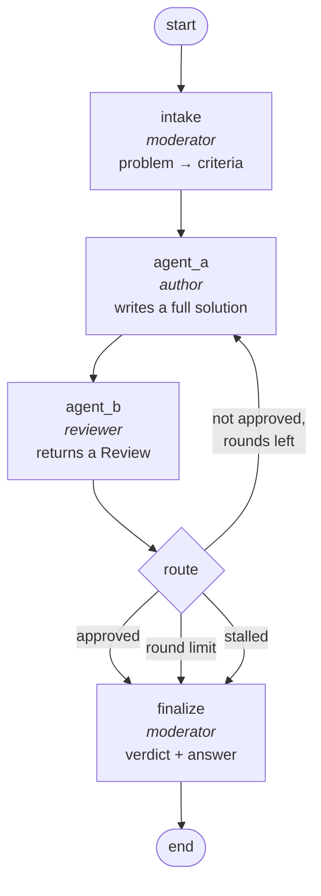
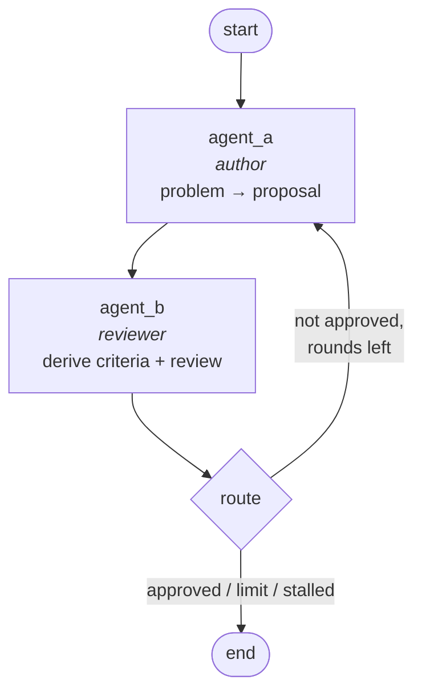
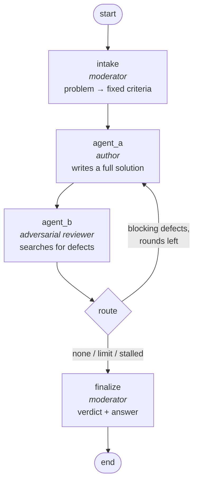

# Architecture

## V1 — Moderated criteria



Four nodes, one cycle. The cycle is `agent_a → agent_b → agent_a`, and everything
interesting is in when it exits.

## V2 — Post-hoc reviewer



V2 has two model-calling nodes. Agent B returns `PostHocReview`, which extends the
normal review with `criteria`. Those criteria are appended to `criteria_history` on
every round. Agent B also sets the terminal verdict; there is no intake or finalizer
call, and the latest Agent A proposal becomes the final answer.

## V3 — Adversarial reviewer



V3 deliberately uses V1's topology and its fixed intake criteria. Its
`AdversarialReview` replaces scoring with five categorized defect lists. Each
`Defect` contains severity, evidence, and a required correction. `approved` and
`required_changes` are computed fields: approval is true exactly when the review
contains no `blocking` findings. The model therefore cannot approve and report a
blocking defect at the same time.

V3's stall guard treats a falling blocking-defect count as progress. Flat or rising
counts across the configured patience window send the run to the moderator finalizer
as `stalled`.

## V1 roles

| Node | Role | Returns | Notes |
| --- | --- | --- | --- |
| `intake` | Moderator | `Criteria` (structured) | Restates the problem, emits 3–6 checkable criteria |
| `agent_a` | Author | free text | Always a **complete standalone** solution, never a diff |
| `agent_b` | Reviewer | `Review` (structured) | Grades against the criteria only |
| `finalize` | Moderator | free text | Derives the verdict, writes the user-facing answer |

## Why the moderator isn't the router

The obvious reading of "the moderator decides whether to loop" is an LLM call that
looks at the review and answers yes/no. This project deliberately doesn't do that.

Agent B already returns `approved: bool`. A model asked to re-derive that decision
from the same evidence adds a round trip, real cost, and a fresh way to be wrong — in
exchange for no information that wasn't already in the boolean. So routing is a plain
Python conditional edge.

The moderator is a real LLM at the two points where judgment genuinely adds
something: **framing** an ambiguous problem into gradeable criteria, and
**synthesising** several rounds of history into one answer. Those are the parts a
`bool` can't do.

## Routing rules

`route()` in `graph.py` picks the destination:

| Condition | Next | Verdict |
| --- | --- | --- |
| `review.approved` | `finalize` | `consensus` |
| `round >= max_rounds` | `finalize` | `no_consensus` |
| Score flat or falling for 2 consecutive rounds | `finalize` | `stalled` |
| otherwise | `agent_a` | — |

The **stall guard** exists because the round limit alone is a bad backstop. If a
criterion is unsatisfiable — or the reviewer has fixated — the score parks at 6/10 and
every remaining round is a full author+reviewer pair spent producing nothing. The
guard notices the score has stopped moving and exits early. `STALL_PATIENCE` controls
how many flat rounds to tolerate (default 2) — like every tunable, it's an environment
variable, read through `config.py`.

`route()` returns only a destination; **`finalize` derives the verdict itself** from
the same three signals. One place decides how a run is characterised, so the label in
the transcript can't drift from the reason the loop actually stopped.

## State

```python
class ConsensusState(TypedDict, total=False):
    problem: str                                     # input
    max_rounds: int                                  # input, defaults to $MAX_ROUNDS
    restated_problem: str                            # set by intake
    criteria: list[str]                              # set by intake
    round: int
    proposal: str                                    # latest only
    proposals: Annotated[list[str], operator.add]    # full history
    reviews: Annotated[list[Review], operator.add]   # full history
    verdict: Literal["consensus", "no_consensus", "stalled"]
    final_answer: str
    usage: Annotated[list[Usage], operator.add]      # tokens + cost per LLM call
```

`proposals`, `reviews`, and `usage` use additive reducers, so each round **appends**
instead of overwriting. That history is what `finalize` summarises over and what the
transcript renderer (and the web UI) walks pairwise — round *N*'s proposal sits at
`proposals[N-1]` and its review at `reviews[N-1]`.

`proposal` (singular) is the latest one, kept separate so `agent_a` and `agent_b`
don't have to index into the history on every call.

`usage` records accounting per node execution: token totals, reasoning/cache token
details, generation ID, provider-reported cost, upstream inference cost, and a cost
source label. LangChain's normalized `usage_metadata` supplies provider-neutral token
counts; OpenRouter's exact billed cost is merged from raw response metadata rather
than estimated from a mutable price table. Providers that do not report cost retain
`None` with `cost_source="unavailable"`. The two structured-output nodes (`intake`,
`agent_b`) call `with_structured_output(..., include_raw=True)` specifically to retain
the raw response alongside the parsed object. The data rides through graph state into
the web UI, SQLite history, replay, and transcript exports.

## Structured verdicts

Agent B returns a validated object, not prose the router has to pattern-match:

```python
class Review(BaseModel):
    approved: bool
    score: int  # 1-10
    critique: str
    required_changes: list[str]
```

Both providers get this via `with_structured_output(Review, method="json_schema")`,
which uses native schema-enforced structured outputs rather than the tool-calling
workaround.

One wrinkle worth knowing: **Anthropic's structured outputs don't support numeric
bounds**, so LangChain strips Pydantic's `ge`/`le` off the wire schema (it folds the
range into the field description instead) and enforces them client-side. A model
returning `11` would therefore raise a `ValidationError` *after* the call — throwing
away a run that already spent several expensive rounds. `Review` has a `mode="before"`
validator that clamps to 1–10 instead. The score only drives stall detection, so
clamping costs nothing and removes the crash.

## Prompt design

The two prompt rules that matter most, both in `prompts.py`:

1. **Criteria must be checkable** (`MODERATOR_INTAKE`). The prompt spends most of its
   budget on this with contrasting examples, because vague criteria are the single
   biggest cause of a loop that won't converge.

2. **The reviewer may not move the goalposts** (`AGENT_B`). A critic that invents a
   new requirement each round guarantees `no_consensus` no matter how good the author
   is. Agent B is told to grade against the listed criteria and nothing else, and to
   approve when they're met even if further polish is imaginable.

`agent_a` omits the critique block **entirely** on round 1, rather than sending
placeholder text like "N/A" that the model has to interpret.

## Files

```
src/agentic_consensus/
├── variants/
│   ├── registry.py               public IDs and graph factories
│   ├── v1_moderated_criteria/    V1 graph, nodes, prompts, state
│   ├── v2_posthoc_reviewer/      V2 graph, nodes, prompts, state
│   └── v3_adversarial_reviewer/  V3 graph, nodes, prompts, state
├── config.py      every tunable, read from the environment
├── state.py       backward-compatible V1 state exports
├── schemas.py     Review / Usage / Verdict shared by variants
├── models.py      provider-agnostic model factories
├── usage.py       shared token and provider-cost accounting
├── graph.py       backward-compatible default V1 graph export
├── transcript.py  markdown / HTML / JSON renderers
├── __main__.py    CLI runner
├── web.py         FastAPI app (`--extra web`): routes, worker thread, persistence
├── web_templates.py  Home/History/Replay pages — shared CSS/JS, self-contained HTML
└── db.py          SQLite run history for the web UI
```
